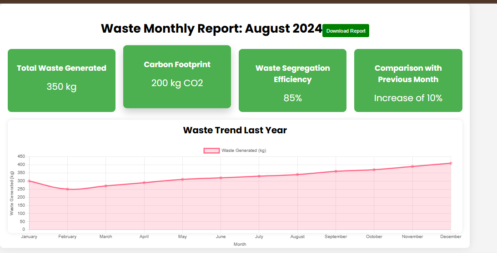
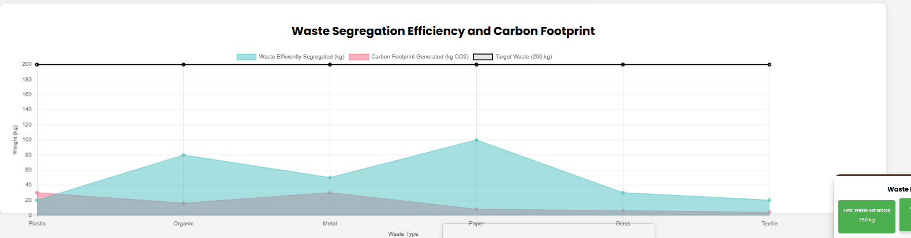
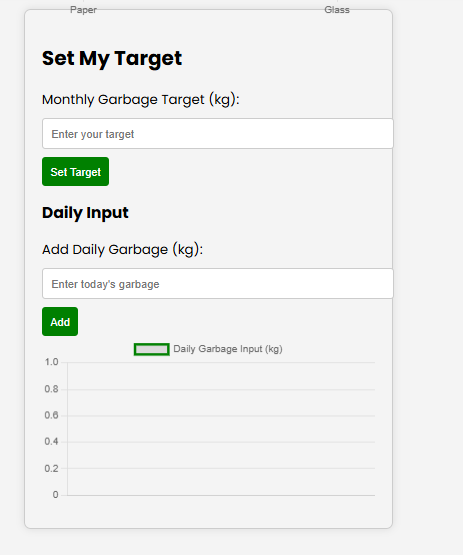
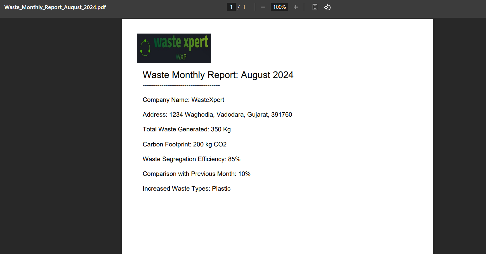

<h1>📺 Waste Management DashBoard</h1>

## OverView
> This is one of the feature of our Waste Management System as a software, that we build during our 2024 SIH hackathon. So that user can see monthly report of waste generated also can download monthly report pdf and set limit how much waste user can generate.
>
> ---
>
> ## Features
> - Graph
> - Images
> - Custom limit can set
> - Pdf can download of monthly report
> - How much carbon footprint user's waste generating
>
> ---
>
> **Screenshots**

***TechStack***
Uses node.js, chart.js and HTML, CSS and JavaScript.
